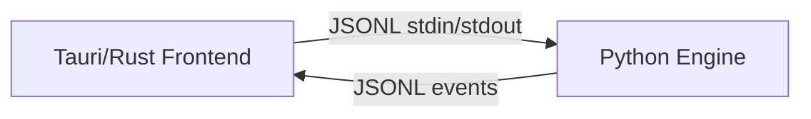
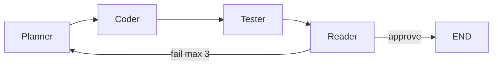

# PonyFlow

A local-first desktop app that runs a multi-agent AI pipeline (Planner → Coder → Tester → Reader) to generate, test, and review code using local LLMs via Ollama. No cloud, no API keys, no data leaves your machine.

PonyFlow solves the problem of AI-assisted coding without sacrificing privacy or control. It's for developers who want real AI code generation — not autocomplete — but refuse to send proprietary code to third-party APIs. The entire pipeline runs locally on your hardware.

---

## Why Local?

**Privacy:** Your code never leaves your machine. No telemetry, no training data harvesting, no cloud logging. What you write stays yours.

**Offline:** Works without internet after initial model downloads. Pull the models once, then unplug.

**Cost:** Zero per-token charges. No API keys, no subscription, no rate limits. The only cost is your electricity.

**Control:** Choose your own models. Swap them per agent. Tune temperatures. The pipeline is yours to modify.

---

## Why 4 Agents?

A single LLM call produces worse code than a pipeline of specialized agents. Each agent has a different model tuned for its task:

- **Planner** (mistral): Structures the request into a JSON plan. Breaks down vague prompts into actionable steps. On rework, revises the plan using test and review feedback.
- **Coder** (llama3): Writes minimal Python code under Ponytail constraints. No fluff, no overengineering.
- **Tester** (phi3): Performs an LLM-based static check and reports pass/fail with concrete suggestions (does not execute the generated code).
- **Reader** (mistral): Reviews for security issues, bad practices, and Ponytail violations.

On fail, the Reader sends the run back to the **Planner** (loop, max 3 iterations) so the plan can be fixed before coding again. This separation of concerns catches bugs a single agent would miss — logic errors, security holes, over-engineered solutions.

---

## The Ponytail Philosophy

Ponytail is a strict code-generation ruleset loaded into the Coder agent at runtime. It enforces minimal, high-signal code. The rules (in priority order):

1. **YAGNI** — Do we need this at all? If not, delete it.
2. **Prefer stdlib** — No PyPI dependency if standard library works.
3. **Prefer native** — Use OS-native features before libraries.
4. **Prefer existing deps** — Reuse what's already imported.
5. **Prefer one-liners** — Can this be a single expression?
6. **Only then write minimal code** — Shortest correct solution wins.

Behavior constraints: no comments, no type annotations unless required, no docstrings, no edge case handling unless the edge case exists. Prefer deletion over addition. Zero-overhead abstractions only.

This is enforced at the prompt level — the rules are prepended to every Coder call. They are not optional and must never be removed.

---

## Architecture



The Rust backend is thin (≤300 lines) — process management only. It spawns the Python engine, relays JSONL over stdin/stdout, and handles health checks. All agent logic lives in Python. The live iteration loop is in `engine/engine.py`; `engine/graph.py` provides the `should_rework` routing helper used by tests.

Deeper notes and ADRs: [docs/](docs/).

### Agent Pipeline



Max 3 iterations. On fail, control returns to the Planner with prior plan, code, test, and review context.

---

## Quick Start

### Prerequisites

- Python 3.10+
- Ollama installed and running

### Install Ollama Models

```bash
ollama serve
ollama pull llama3
ollama pull mistral
ollama pull phi3
```

### Development (CLI)

```bash
# Install Python deps
pip install -r engine/requirements.txt

# Run a single prompt (natural language)
python engine/engine.py --cli "write a prime checker"
```

The CLI accepts a prompt directly via `--cli "your prompt"` and prints human-readable output — no JSONL needed.

### Development (GUI)

```bash
# Install frontend deps
npm install

# Install Python deps (in engine/)
cd engine && pip install -r requirements.txt

# Run Tauri dev (frontend + Python engine)
npm run tauri:dev
```

This starts Vite (hot-reload frontend at `localhost:1420`) and launches the Tauri window with the Python engine spawned as a subprocess.

> **Note:** Windows installers (`.msi`) ship with GitHub Releases (tags `v*`). macOS/Linux installers are not automated yet — build from source using the steps above.

---

## Project Structure

```
ponyflow/
├── src-tauri/           # Rust backend (minimal — process management only)
│   ├── src/main.rs      # Spawns Python, relays JSONL, health checks
│   └── Cargo.toml
├── src/                 # React 19 + TypeScript + Tailwind
│   ├── components/      # AgentTrace, CodeBlock, InputBar, RunCard, RunHistory, StatusBar
│   ├── stores/          # Zustand stores (runStore, settingsStore)
│   ├── lib/             # Protocol types, engine bridge, utils
│   └── hooks/           # useEngine hook
├── engine/              # Python engine (source of truth)
│   ├── engine.py        # JSONL main loop (live pipeline)
│   ├── graph.py         # should_rework routing helper
│   ├── state.py         # AgentState TypedDict
│   ├── agents/          # planner, coder, tester, reader
│   │   └── skills/
│   │       └── ponytail.md
│   ├── utils/llm.py     # Ollama factory
│   ├── ponyflow.spec    # PyInstaller spec
│   └── requirements.txt
├── docs/                # Architecture notes + ADRs
├── package.json
└── README.md
```

---

## Protocol

Brief reference for the JSONL protocol between frontend and engine.

### Input (Frontend → Engine)

```json
{"type": "run", "id": "uuid", "prompt": "write a prime checker"}
{"type": "cancel", "id": "uuid"}
```

### Output (Engine → Frontend)

```json
{"type": "agent_start", "agent": "planner", "run_id": "..."}
{"type": "token", "agent": "coder", "content": "def is_prime(n):"}
{"type": "agent_end", "agent": "planner", "output": "...", "run_id": "..."}
{"type": "run_complete", "run_id": "...", "code": "...", "state": {...}}
{"type": "run_error", "run_id": "...", "error": "..."}
{"type": "engine_error", "message": "...", "fatal": true}
```

---

## Building for Production

```bash
# Build Python engine
cd engine
pip install -r requirements.txt
python -m pyinstaller ponyflow.spec

# Build Tauri app (bundles engine binary + frontend)
cd ..
npm run tauri:build
```

Output: `src-tauri/target/release/bundle/` (Windows MSI under `msi/`).

Release automation: push an annotated tag matching `v*` (for example `v0.1.0`) to trigger `.github/workflows/build-windows.yml`, which uploads the MSI to a GitHub Release. See [docs/decisions/0002-windows-packaging.md](docs/decisions/0002-windows-packaging.md).

---

## License

MIT License — Copyright (c) 2026 Emilio Gordillo Esparragoza
