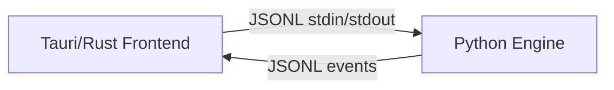
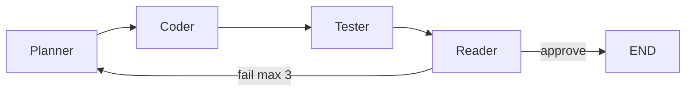

# Architecture

## System

The Rust shell spawns the Python engine, relays JSONL, and reports health. All agent logic lives in Python under `engine/`.

## Agent pipeline

Each iteration runs the full cycle. On fail (failed tests or Reader rejection), control returns to the **Planner** so the plan can be revised with feedback before coding again. Max 3 iterations.

## Runtime vs `graph.py`

- **Live loop:** [`engine/engine.py`](../engine/engine.py) owns the iteration loop (`Planner → Coder → Tester → Reader`).
- **Routing helper:** [`engine/graph.py`](../engine/graph.py) exposes `should_rework`, shared with unit tests. It is not a LangGraph `StateGraph` definition.
- **Tester:** performs an LLM-based static check; it does not execute generated code.

See [decisions/0001-rework-to-planner.md](decisions/0001-rework-to-planner.md) for why fail routes to Planner.
